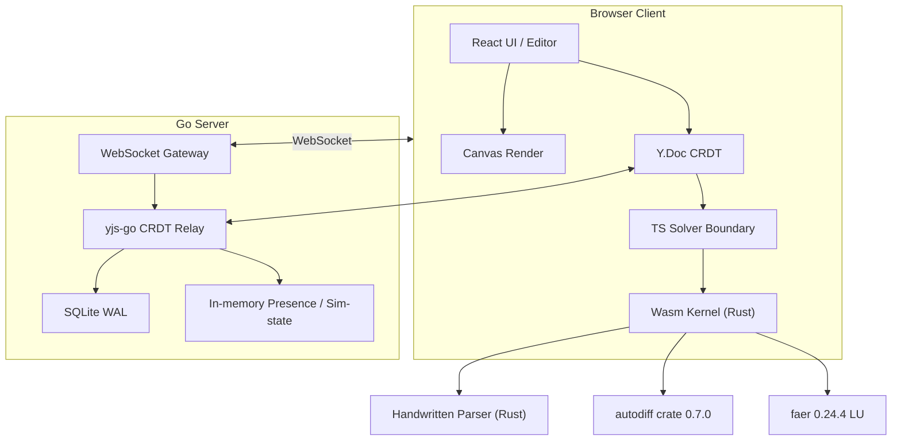
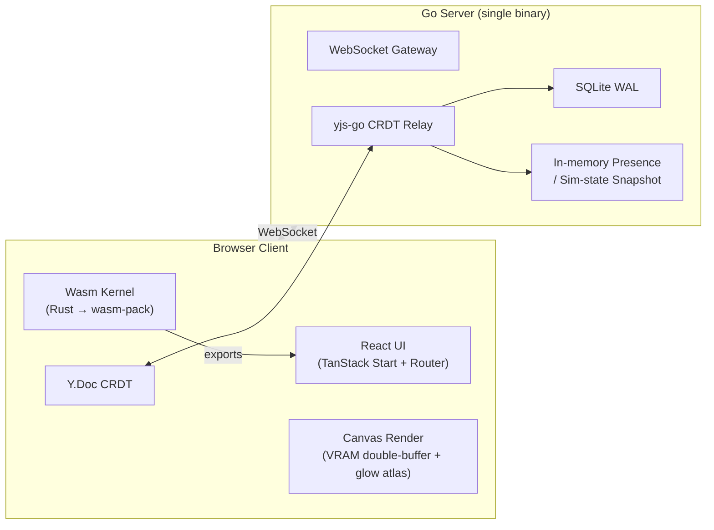
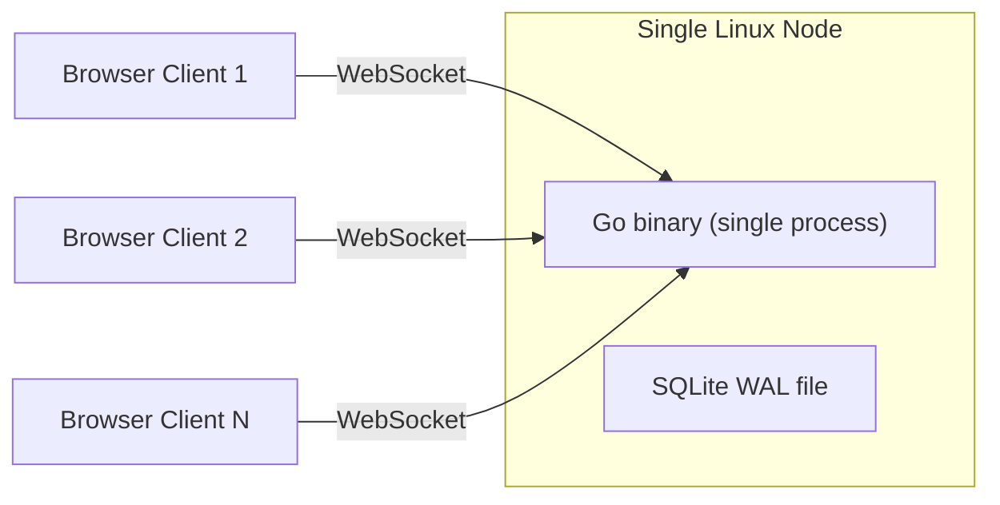
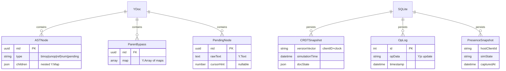

# Architecture Spine — NewSD

## Design Paradigm

The composite paradigm is **Host-Authoritative CRDT Document Model with Wasm Numeric Core and Fixed-Point Canvas Render**. Four pillars jointly govern the system:

| Pillar | What it means | Lives in |
|---|---|---|
| **Host-Authoritative Simulation** | Simulation runs on the host client only; server relays but never runs sim. Host migration carries CRDT version-verified snapshot for continuation (AD-11). | Host client (browser) — `src/lib/sim/` |
| **CRDT Document Model** | Canvas model and formula AST live in Yjs CRDT (Y.Map nested AST + paren bypass Y.Array; pending nodes as Y.Text). Server relays CRDT ops via yjs-go. | Client `src/lib/collab/` + server CRDT relay |
| **Wasm Numeric Core** | All simulation-step numeric evaluation passes through Rust+Wasm kernel (BDF integrator, Newton solver, autodiff, sparse LU, dimension check, non-negative clamp, DELAY expansion). TS side is a thin Solver boundary calling Wasm exports. | `wasm/` (Rust) + TS boundary in `src/lib/solver/` |
| **Canvas 2D Fixed-Point Render** | VRAM double-buffer (char-code buffer + color-index buffer) with glow atlas pre-rendered per ASCII char x brightness tier; hue-shift GPU fragment shader, nearest sampling, no per-glyph shadowBlur. Dirty-region updates per FR-CANVAS-4. | `src/lib/render/` |

## Invariants & Rules

### AD-1 [ADOPTED] — F-Paradigm: Four-pillar design paradigm

- **Binds:** 全部 FR-SIM/FR-COLLAB/FR-CANVAS/FR-UI, PRD §1.1/§1.2/§2.1
- **Prevents:** 各子系统范式漂移(如仿真散到多客户端 / 渲染回退 shadowBlur / 数值跑 TS 主线程)
- **Rule:** 四范式为架构顶层不变量,子系统 AD 不得违背

### AD-2 [ADOPTED] — F-Envelope: Single-node deployment envelope

- **Binds:** F3, F2(#7 Wasm.Memory), F1(WebGL), addendum §3.1/§3.2
- **Prevents:** 运行包络整维度空缺(skill Finalize 失败定义)/ MVP 过度工程化上容器+云+可观测栈
- **Rule:** MVP 单节点单二进制 + SQLite WAL,无容器/云/独立可观测栈,迁移走 addendum §3.2 阈值

### AD-3 — F3: Go monolith backend

- **Binds:** FR-COLLAB-1/2/3/5, FR-BOARD-1
- **Prevents:** 双语言栈跨服务 IPC 复杂度(混合方案) / Node 弱类型后端演进
- **Rule:** 后端单 Go 进程, 不引入 Node 服务

### AD-4 — F3-yjs-server: yjs-go CRDT relay

- **Binds:** F3 Go 单体后端 CRDT 中继路径落地
- **Prevents:** 自研 Go Yjs binding 重活 / 换不成熟 automerge-go / 退回 Node 混合违 F3
- **Rule:** Go 服务端 CRDT 中继用 yjs-go,遇阻回评自研非退 Node

### AD-5 — F2: Wasm solver kernel boundary + circuit breaker

- **Binds:** FR-SIM-1/2/4/6/7/8, #1/#2/#7, FR-COLLAB-4
- **Prevents:** TS 主线程数值爆炸污染 UI 帧率 / 恶意公式无沙箱逃逸 / 隐式法放行代数死锁环(FR-SIM-2)
- **Rule:** 所有仿真步数值求值经 Wasm 内核, TS 不得直接跑仿真步; 编译期拓扑检查(切 stock 流出边后检测残余环)拒绝代数环, 不因隐式法可解而放行(FR-SIM-2). 熔断(#7)与降级(FR-SIM-8)边界: 资源耗尽(Wasm.Memory 64MB / 单步 wall-clock >500ms / AST MAX_NODES 5000 编译期 / 牛顿 maxIterations 100 仍不收敛)→ `[SYSTEM HALTED]` 暂停报错; 残差范数非收敛(数值收敛压力)→ FR-SIM-8 降级链(降级不阻断). 两者不混淆触发.

### AD-6 — F2-amend: Solver crate composition (handwritten parser + autodiff + faer)

- **Binds:** parser 复用 prototype formula.ts 结构扩 @uuid/[单位] 产生式(#9/#10 直落);AST 为单一真相源供 autodiff 图/量纲校验/tokenizer 共用;LU/sparse 交 faer(v0.24.4 current)
- **Prevents:** meval 不暴露 AST 致双源翻译层、meval 8年 stale、全手写 AD 数值正确性自担
- **Rule:** parser 手写、autodiff 借 autodiff crate(0.7.0)、LU 借 faer;不引入 meval

### AD-7 — F4: BDF startup strategy

- **Binds:** FR-SIM-1/8, #1
- **Prevents:** BDF-2+恒值外推退化一阶违§1.1无感(频繁降级黄点) / BDF-3+过度工程稳定降 / 纯后向欧拉降级链首级空转
- **Rule:** Wasm 求解器内核按阶数切换状态机起步, 牛顿初始猜测按当前阶数分配外推法

### AD-8 — F5: Jacobian active-set strategy

- **Binds:** FR-SIM-4, #2
- **Prevents:** Broyden 累积漂移致长仿真后期牛顿发散难排查 / Chattering 致雅可比频繁重算性能崩 / 后置钳制(nv=0)违 FR-SIM-3 物质守恒幽灵渗漏
- **Rule:** Wasm 求解器内核维护活动集状态机 + 滞回带, 约束激活后全重算雅可比与 LU 稀疏模式

### AD-9 — F1: VRAM render (glow atlas + double buffer + hue-shift shader)

- **Binds:** FR-CANVAS-3/4/5, FR-UI-6, PRD §2.1/§1.4/§4.1, #8
- **Prevents:** shadowBlur 逐字符 GPU 模糊致 1000 图元@60FPS 不可达 / 改 PRD 违§1.1 硬约束门槛 KPI
- **Rule:** 渲染层用图集预渲染 + 双缓冲 + Shader, 禁 per-glyph shadowBlur

### AD-10 — F6: AST structural conflict tiered fallback

- **Binds:** FR-COLLAB-6, #3, #4(待定节点冲突作子集)
- **Prevents:** 单一策略场景C 覆盖硬伤(锁子树边界难定 / 标冲突区错误传播)
- **Rule:** AST 合并后拓扑比较检测, 分级回退轻标区+锁子树重文本级

### AD-11 — F7: Snapshot-CRDT version alignment

- **Binds:** FR-COLLAB-3/5, #5, PRD §1.1 反指标
- **Prevents:** 新房主旧模型结构+新初始值续跑跳跃不连续 / 阻塞 CRDT 损协作
- **Rule:** 快照须带 CRDT 版本向量, 新房主校验对齐决定续跑/增量重跑

### AD-12 — F8: Degradation interface abstractions (MVP define interfaces not impl)

- **Binds:** #6, §5.1 逃生阀, addendum §8.3
- **Prevents:** ⑤ 降级名存实亡(handoff #6 明文) / 体量超载时重构多模块成本非线性
- **Rule:** MVP 须定义三项抽象接口隔离降级两端且接口非空(非空桩: 数据兼容层须支持 Y.Map 嵌套 AST 与 flat string 两种公式格式, 不只读一种), 降级逻辑本身可不实现但接口契约须可验证

### AD-13 — F-Gap1-A: Pending node rawText as Y.Text

- **Binds:** 待定节点 rawText 字段为 Y.Text,并发输入插入合并不丢字
- **Prevents:** string 键级 LWW 并发输入一边丢
- **Rule:** pending 节点 {type:'pending', rawText:Y.Text, cursorHint:number|null}

### AD-14 — F-Gap1-B: Parens stored as bypass Y.Array of maps, NOT AST group nodes

- **Binds:** AST 节点纯语义(binop/unop/ref/num/pending),括号不进 AST;公式根挂 parens 旁路(Y.Array of maps),按 nid(UUIDv4)引用 AST 节点;每个 AST 节点带 nid 字段
- **Prevents:** 显式 group 进 AST 致啰嗦+去冗余 pass 静默改写用户输入+g-4 链式判定非局部;不显式存纯版致结合性冲突归因模糊
- **Rule:** paren 副本是 AST 外双结构(轻旁路),非 AST 内 group 节点;op-4 结合性翻转时 paren 不自动迁移(子树重建语义正确,用户重加);渲染层须投射 paren 回括号. nid 分配为单调递增计数器(非 hash),子树重建时旧 nid 保留语义正确性,新节点发新 nid 不复用.

### AD-15 — F-NonHostDataflow: Non-host client subscribes to host sim state

- **Binds:** AD-1(房主权威仿真), FR-COLLAB-3, AD-11(快照续跑)
- **Prevents:** 非房主客户端本地跑 Wasm 仿真步致与房主结果分叉 / 每次按键仿真显示闪烁
- **Rule:** 非房主客户端权威仿真显示态由房主计算结果经服务端中继广播驱动(订阅非计算); 本地 Wasm 仅限非仿真预览(量纲/视觉实时预览, 非仿真步求值)

**Dependency direction (who may depend on whom):**



## Consistency Conventions

| Concern | Convention |
|---|---|
| Naming — AST node identification | Each AST node carries `nid` = UUIDv4. Paren bypass references AST nodes by `nid`. Y.Map keys are nested AST node identifiers. |
| Naming — AST node types | {binop, unop, ref, num, pending}. No group node type (parens are external bypass). |
| Naming — formula reference id/name layering | Storage layer: CRDT AST ref nodes store stockId (UUIDv4). Display layer: editor renders `@<uuid>` as the referenced stock's name; renaming a stock changes name only, formula refs never break (handoff #10). |
| Data & formats — snapshot version vector | Y.Doc clientID + clock vector carried in snapshot. |
| Data & formats — circuit breaker envelope | ASCII `[SYSTEM HALTED: <reason>]` on Wasm breach (AD-5). |
| Data & formats — pending node shape | `{type:'pending', rawText:Y.Text, cursorHint:number|null}` (AD-13). |
| Data & formats — paren bypass structure | Y.Array of maps keyed by `nid`, not AST group nodes (AD-14). |
| State — simulation numeric mutation | All sim-step numeric evaluation inside Wasm kernel (AD-5). TS side does not run simulation steps. |
| State — CRDT single source of truth | Y.Doc CRDT is the single source of truth for the model. |
| State — host-authoritative sim state | Server relays CRDT only; does not run simulation (AD-3, AD-4). Host client owns sim state and snapshots. |
| State — SQLite persistence | SQLite WAL single file, in-process (no separate DB process) (AD-2). |

## Stack

| Name | Version |
|---|---|
| React | ^19.2.0 |
| TanStack Start | ^1.168.26 |
| TanStack Router | ^1.170.16 |
| Vite | ^8.0.16 |
| Tailwind CSS | v4 |
| TypeScript | ^5.8.3 |
| bun | (runtime, as per prototype) |
| Rust | stable toolchain |
| wasm-pack | latest stable |
| faer | 0.24.4 |
| autodiff | 0.7.0 |
| Go | stable |
| yjs-go (averyyan/yjs-go) | pinned via go.mod at implementation |
| SQLite | 3.x, WAL mode |

## Structural Seed

### System / Container Context



### Deployment & Environments



### Core-Entity ERD



### Minimal Source Tree

```
{root}/
  src/
    lib/
      sd/               # brownfield: existing system-dynamics core (formula.ts, etc.)
      render/           # Canvas 2D fixed-point render (VRAM double-buffer, glow atlas, hue-shift shader)
      collab/           # Yjs CRDT document model (Y.Map AST, paren bypass, pending nodes, merge logic)
      solver/           # TS thin boundary — Wasm exports caller (Solver boundary per AD-5)
  wasm/
    src/                # Rust solver kernel: parser, autodiff, faer LU, BDF integrator, Newton solver, dimension check, non-negative clamp, DELAY expansion
    Cargo.toml
  server/
    main.go             # Go single binary: WebSocket gateway, yjs-go CRDT relay, SQLite persistence, in-memory presence
    go.mod
  package.json          # brownfield: React + TanStack Start + Vite + Tailwind
```

## Capability → Architecture Map

| Capability / Area | Lives in | Governed by |
|---|---|---|
| FR-SIM-1 (implicit BDF, multi-step integrator) | Wasm kernel (`wasm/src/`) | AD-5, AD-7 |
| FR-SIM-2 (algebraic loop detection / stock circuit breaker) | Wasm kernel compile-time topological check | AD-5 |
| FR-SIM-3 (flow conservation / single convergence value) | Wasm kernel (`wasm/src/`) | AD-5, AD-8 |
| FR-SIM-4 (rate clamping, non-negative stock) | Wasm kernel (`wasm/src/`) | AD-5, AD-8 |
| FR-SIM-5 (DELAY function as ghost stocks) | Wasm kernel (`wasm/src/`) | AD-5, AD-6 |
| FR-SIM-6 (circuit breaker / system halt) | Wasm kernel + TS Solver boundary | AD-5, AD-2 |
| FR-SIM-7 (DELAY function) | Wasm kernel (`wasm/src/`) | AD-5, AD-6 |
| FR-SIM-8 (degradation chain) | Wasm kernel + TS Solver boundary | AD-5, AD-7, AD-12 |
| FR-COLLAB-1 (multi-user presence) | Go server (`server/`) | AD-3, AD-2 |
| FR-COLLAB-2 (presence awareness) | Go server in-memory + CRDT relay | AD-3, AD-4 |
| FR-COLLAB-3 (host migration) | Go server snapshot + host client | AD-11, AD-2 |
| FR-COLLAB-4 (lock-free editing) | Y.Doc CRDT (`src/lib/collab/`) | AD-1 paradigm, AD-10 |
| FR-COLLAB-5 (snapshot persistence) | Go server SQLite (`server/`) | AD-11, AD-2 |
| FR-COLLAB-6 (merge-undo / conflict resolution) | Y.Doc CRDT + `src/lib/collab/` | AD-10, AD-13, AD-14 |
| FR-CANVAS-3 (ASCII glyph rendering) | `src/lib/render/` | AD-9 |
| FR-CANVAS-4 (canvas viewport) | `src/lib/render/` | AD-9, AD-2 |
| FR-CANVAS-5 (mini-map) | `src/lib/render/` | AD-9 |
| FR-UI-6 (CRT background drift, per-glyph glow) | `src/lib/render/` (glow atlas) | AD-9 |

## Deferred

The following are intentionally not decided at this altitude:

- **F5-perf (Jacobian full recompute performance):** Whether full Jacobian recompute + sparse LU can meet PRD section 1.4's 100 steps/s target for 100-stock scale. Open question from memlog. Implementation-time calibration; if target not met, Broyden approximation must be re-evaluated.
- **F1-quality (glow atlas vs shadowBlur visual parity):** Whether VRAM atlas glow can reproduce prototype per-glyph shadowBlur neon quality. Open question from memlog. Implementation-time visual prototype comparison required before closing FR-UI-6 acceptance criteria.
- **F6-threshold (light/heavy conflict enumeration):** The light vs heavy conflict classification threshold cannot be exhaustively enumerated at architecture time. Open question from memlog. Implementation-time calibration against real conflict scenarios.
- **F7-snapshot-freq (snapshot upload frequency):** FR-COLLAB-5 specifies "periodic" without concrete frequency. Open question from memlog. Implementation-time calibration balancing replay cost vs host startup latency.
- **Adaptive step-size:** Lives inside the FR-SIM-8 degradation chain. Not an MVP requirement; deferred to implementation within that chain.
- **Broyden re-evaluation:** Only triggered if F5-perf fails the 100 steps/s target. Not an architecture decision.
- **Observability stack / cloud migration / multi-node WS gateway:** Addendum section 3.2 threshold-triggered. Not MVP.
- **AST conflict light/heavy threshold enumeration:** Implementation-time calibration against real conflict scenarios.
- **VRAM glow quality acceptance criteria:** Implementation-time visual prototype vs shadowBlur comparison.
- **Go SQLite driver choice:** Implementation-time decision, constrained by single-binary envelope (AD-2).
- **Snapshot upload frequency:** Implementation-time calibration (deferred from F7-snapshot-freq).
- **Rust async runtime for Wasm:** No decision needed at MVP — Wasm solver kernel is synchronous compute, not I/O-bound.
- **Authentication / authorization model:** Not scoped to MVP. Addendum section 3.2 threshold-triggered.
- **Snapshot quiescence protocol (Reviewer Gate hole #3):** Whether snapshot capture must drain in-flight CRDT sync before reading, vs idempotent replay guard. AD-11's version vector + current-CRDT-wins replay already prevents double-application of ops on host handoff; the quiescence-vs-guard choice is an implementation-time concurrency decision, not an architecture invariant.
- **Prettier config baseline:** Inherit `lovable/prototype`'s `eslint-plugin-prettier` implicit defaults (no explicit `.prettierrc` on prototype today). Establish root `.prettierrc` at implementation kickoff before first TS/JS code lands on `main`, so editor/CI format-on-save activates deterministically instead of no-op'ing. Implementation-time tooling decision, not an architecture invariant.
