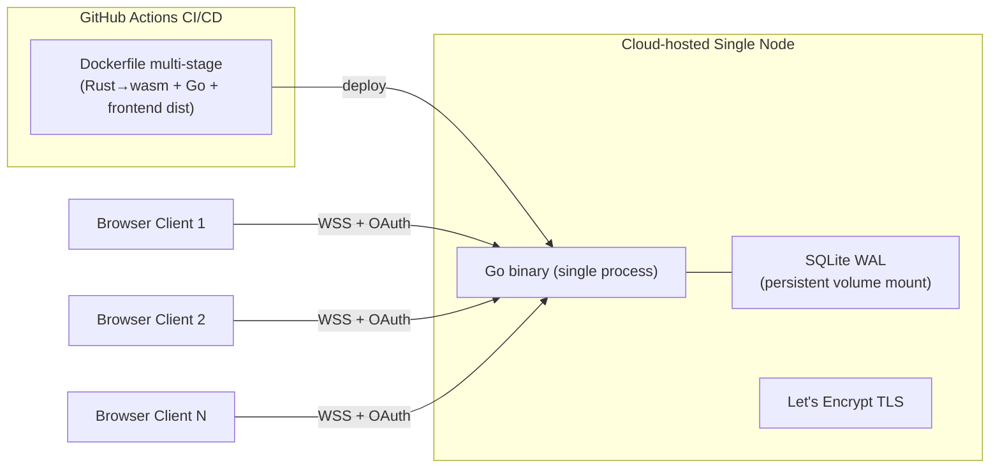
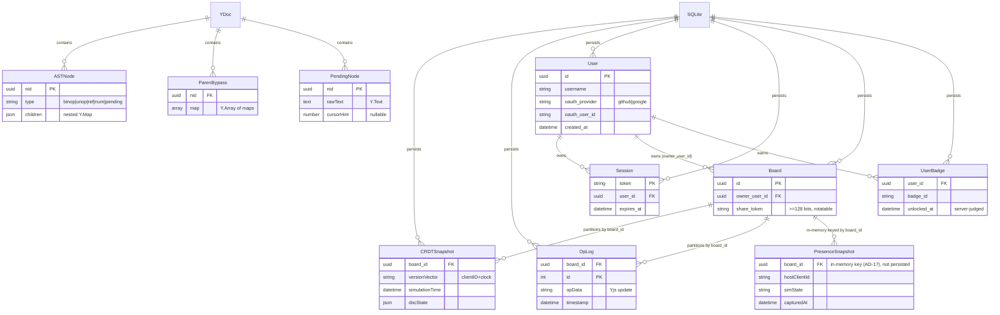

# Architecture Diagrams — NewSD

> 本 companion 承载 SPEC.md 的所有图(diagram)。SPEC.md kernel 仅持散文,图一律落 companion。图源引自 `ARCHITECTURE-SPINE.md`(adopted companion),此处为下游便捷复刻 + 局部增强。AD ID 锚点稳定,spine 修订不影响本文件引用。

## 1. 系统上下文(System / Container)

浏览器客户端 ↔ Go 单体服务端,WebSocket 通道。

```mermaid
flowchart LR
    subgraph Browser["Browser Client"]
        Wasm["Wasm Kernel\n(Rust → wasm-pack)"]
        ReactUI["React UI\n(TanStack Start + Router)"]
        YDoc["Y.Doc CRDT"]
        Render["Canvas Render\n(VRAM double-buffer + glow atlas)"]
    end

    subgraph Server["Go Server (single binary)"]
        OAuth["OAuth Handler\n(GitHub+Google callback)"]
        Session["Session Store\n(mem + SQLite)"]
        WS["WebSocket Gateway\n(handshake auth)"]
        YjsRelay["yjs-go CRDT Relay\n(viewer op gate)"]
        SQLite["SQLite WAL\n(boards/session/CRDT)"]
        Presence["In-memory Presence\n/ Sim-state Snapshot"]
    end

    Browser -->|OAuth redirect| OAuth
    OAuth --> Session
    Browser <-->|WebSocket (first-frame token)| WS
    Wasm -->|exports| ReactUI
    YDoc <--> YjsRelay
    YjsRelay --> SQLite
    YjsRelay --> Presence
```

**依赖方向(谁可依赖谁):**

```mermaid
flowchart TD
    subgraph Client["Browser Client"]
        ReactUI["React UI / Editor"]
        SolverBoundary["TS Solver Boundary"]
        WasmKernel["Wasm Kernel (Rust)"]
        Render["Canvas Render"]
        YDoc["Y.Doc CRDT"]
    end

    subgraph Server["Go Server"]
        OAuthHandler["OAuth Handler (GitHub+Google)"]
        SessionStore["Session Store (mem + SQLite)"]
        WSGateway["WebSocket Gateway"]
        YjsRelay["yjs-go CRDT Relay"]
        SQLite["SQLite WAL"]
        MemState["In-memory Presence / Sim-state"]
    end

    ReactUI --> YDoc
    YDoc --> SolverBoundary
    SolverBoundary --> WasmKernel
    ReactUI --> Render

    WasmKernel --> HandwrittenParser["Handwritten Parser (Rust)"]
    WasmKernel --> AutodiffCrate["autodiff crate 0.7.0"]
    WasmKernel --> FaerLU["faer 0.24.4 LU"]

    YDoc <--> YjsRelay
    YjsRelay --> SQLite
    YjsRelay --> MemState

    Client -->|OAuth redirect| OAuthHandler
    OAuthHandler --> SessionStore
    SessionStore --> SQLite
    Client <-->|WebSocket (first-frame token)| WSGateway
    WSGateway -->|handshake auth + viewer op gate| YjsRelay
```

关键不变量(AD 锚点):YjsRelay 仅中继 CRDT 不跑仿真(AD-3/AD-4);WasmKernel 是唯一仿真步求值点(AD-5);Render 禁 per-glyph shadowBlur(AD-9);WS 握手首帧 token 鉴权 + viewer CRDT op 网关拒收(AD-16/AD-17);session token 双通道下发 HttpOnly Cookie + JSON body(AD-16)。

## 2. 部署包络(Deployment & Environments)

MVP 单节点云托管(Fly.io/Railway/Render/云 VM,实现期选),单 Go 二进制,SQLite WAL 挂持久卷。Dockerfile 多阶段构建(Rust→wasm + Go binary + 前端 dist)+ GitHub Actions CI/CD(lint→test→build→deploy)必备;域名 + Let's Encrypt TLS 自动;密钥(OAuth client_secret)走云平台 secret env;可观测走云平台内置日志/监控(客户端 `[SYSTEM HALTED]` 熔断事件经 WS 上报 stdout);垂直扩容优先。



迁移触发条件(PostgreSQL/Redis/多节点 WS 网关/独立可观测栈产品)见 addendum §3.2,均非 MVP;垂直扩容优先,水平迁移走阈值。裸机直跑技术可行但非官方目标(AD-18);SQLite 持久卷若平台不支持则提前触发 §3.2 PG 迁移。

## 3. 核心实体 ERD



ERD 关键点:AST 节点纯语义无 group 类型(paren 作外旁路,AD-14);pending 节点 rawText 为 Y.Text(AD-13);CRDTSnapshot 携版本向量(AD-11);CRDT 持久化三表按 board_id 分区(AD-17);User 表 `UNIQUE(oauth_provider, oauth_user_id)` 双 provider 共享(AD-16);Board 携 owner_user_id + share_token(AD-17);UserBadge 由服务端从 CRDT op 流判定写入(防客户端伪造,AD-16);Session token 持久化使进程重启会话不丢(AD-16)。

## 4. 最小源码树(Structural Seed)

```
{root}/
  src/
    lib/
      sd/               # brownfield: 现有 system-dynamics 核心 (formula.ts 等)
      render/           # Canvas 2D 定点渲染 (VRAM 双缓冲, 辉光图集, 色相偏移 shader)
      collab/           # Yjs CRDT 文档模型 (Y.Map AST, paren 旁路, pending 节点, 合并逻辑)
      solver/           # TS 薄边界 — Wasm exports 调用 (Solver boundary per AD-5)
  wasm/
    src/                # Rust 求解器内核: parser, autodiff, faer LU, BDF 积分器, 牛顿求解, 量纲校验, 非负钳制, DELAY 展开
    Cargo.toml
  server/
    main.go             # Go 单二进制: OAuth(GitHub+Google), session, WebSocket 网关(握手鉴权), yjs-go CRDT 中继(角色网关 viewer op 拒收), SQLite 持久化(boards/session/CRDT), 进程内存 presence
    go.mod
  Dockerfile            # 多阶段构建: Rust→wasm + Go binary + 前端 dist (AD-18)
  .github/workflows/     # GitHub Actions CI/CD: lint→test→build→deploy (AD-18)
  package.json          # brownfield: React + TanStack Start + Vite + Tailwind
```
